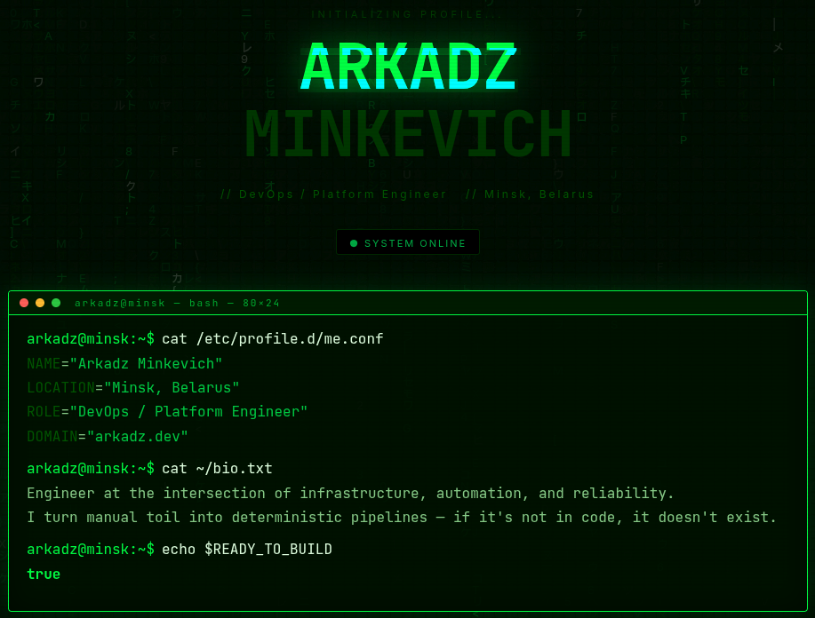

# chibixar.com — Portfolio Infrastructure

> *"If it's not in code, it doesn't exist."*



A personal portfolio website with a hacker/terminal aesthetic. The site itself is the project — every layer of its infrastructure is defined as code and automated end-to-end.

---

## Stack

| Layer | Tool |
|---|---|
| DNS / CDN | Cloudflare |
| Web Server / Proxy | Nginx |
| CI / CD | GitHub Actions |
| Infrastructure as Code | Terraform |
| Configuration Management | Ansible |
| Containers | Docker |
| OS / Shell | Linux · Bash |

---

## Project Structure

```
Portfolio/
├── src/
│   └── App.jsx                   # React frontend — edit CONFIG at the top
├── Dockerfile                    # Multi-stage build: Node → Nginx
├── docker-compose.yml            # Nginx + Certbot with auto SSL renewal
├── index.html
├── vite.config.js
├── package.json
├── package-lock.json
├── .dockerignore
├── docs/
│   └── preview.png
├── nginx/                        # generated by Ansible on server
├── terraform/
│   ├── main.tf                   # Cloud server + firewall
│   ├── variables.tf
│   ├── outputs.tf
│   └── terraform.tfvars.example
├── ansible/
│   ├── inventory.ini             # gitignored
│   ├── playbook.yml
│   ├── group_vars/
│   │   └── all.yml               # gitignored — domain, email, image
│   └── roles/
│       └── portfolio/
│           ├── tasks/main.yml
│           ├── templates/
│           │   ├── default.conf.j2       # Nginx config
│           │   └── docker-compose.yml.j2
│           └── files/
└── .github/
    └── workflows/
        └── deploy.yml            # CI/CD pipeline
```

---

## Local Development

```bash
npm install
npm run dev
# → http://localhost:5173
```

To personalise — edit the `CONFIG` object at the top of `src/App.jsx`. Nothing else needs changing.

---

## Production Build

```bash
# build and run locally
docker build -t portfolio .
docker run -p 8080:80 portfolio
# → http://localhost:8080
```

---

## Infrastructure

### 1. Provision with Terraform

```bash
cd terraform
cp terraform.tfvars.example terraform.tfvars
# fill in: server_token, ssh_public_key
terraform init
terraform plan
terraform apply
# outputs your server IP
```

Creates a cloud server in Helsinki + firewall allowing ports 22, 80, 443.

### 2. Point DNS

In Cloudflare — add an `A` record pointing your domain to the server IP. Set proxy to **DNS only** (grey cloud) for certbot to work.

### 3. Configure with Ansible

```bash
# fill in ansible/inventory.ini with server IP
# fill in ansible/group_vars/all.yml with domain, email, image

ansible-galaxy collection install community.docker
ansible-playbook -i ansible/inventory.ini ansible/playbook.yml
```

The playbook:
- Installs Docker on the server
- Generates a dummy self-signed cert so Nginx can start
- Copies docker-compose and Nginx config
- Pulls the image from GHCR
- Starts containers
- Issues a real Let's Encrypt certificate via Certbot
- Reloads Nginx with the real cert

SSL renews automatically every 12 hours via the Certbot container.

### 4. CI/CD with GitHub Actions

Every push to `main`:
1. Builds the Docker image on GitHub's servers
2. Pushes it to GHCR
3. SSHs into the server and pulls + restarts containers

**Required secrets** (repo → Settings → Secrets → Actions):

| Secret | Value |
|---|---|
| `GHCR_TOKEN` | GitHub PAT with `write:packages` |
| `GHCR_USERNAME` | GitHub username |
| `SERVER_IP` | Server IP |
| `SSH_PRIVATE_KEY` | Contents of `~/.ssh/id_ed25519` |

---

## Gitignored Files

```
.env
ansible/inventory.ini
ansible/group_vars/all.yml
terraform/terraform.tfvars
terraform/.terraform/
terraform/*.tfstate
terraform/*.tfstate.backup
node_modules/
dist/
```

Never commit these — they contain tokens, IPs, and credentials.

---

## Author

**Arkadz Minkevich** · DevOps / Platform Engineer · Minsk, Belarus  
[chibixar.com](https://chibixar.com)
